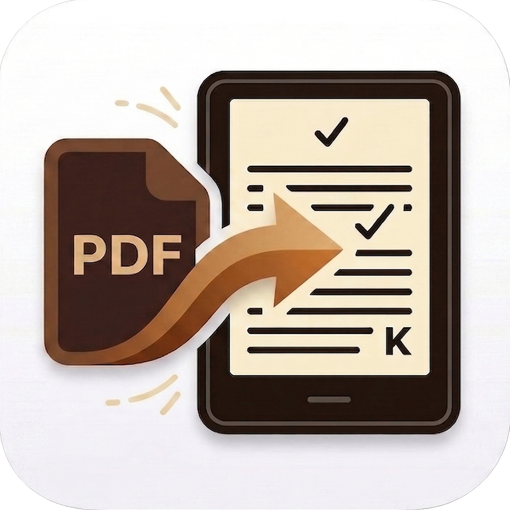

# 📚 Kindleizer - Espresso Edition ☕️

  

**Kindleizer** is a sleek, fast, and completely free PDF-to-Kindle conversion tool designed exclusively for macOS. Instead of wrestling with bulky, complex software, Kindleizer perfectly formats your PDFs for your e-reader with a single click.

With its e-ink texture and custom "Espresso" theme, it feels like a natural extension of your reading experience right on your Mac.

## ✨ Features
* **One-Click Optimization:** Powered by the incredible K2pdfopt engine under the hood, turning complex terminal commands into a single, elegant button.
* **Smart Device Profiles:** Fully supports all resolutions, from legacy Paperwhites to the new Colorsoft and 10.2" Scribe.
* **Native Mac Experience:** Forget standard gray windows. Kindleizer features a beautiful, distraction-free matte dark reader interface.
* **Drag & Drop:** Simply drop your PDF into the app and let it do the heavy lifting.

## 📥 Installation & Download

👉[Download Kindleizer v1.0 DMG](https://github.com/hundebach/kindleizer/releases/latest)

1. Download the `.dmg` file from the link above and double-click to open it.
2. Drag the **Kindleizer** icon into your **Applications** folder.

**⚠️ Important macOS Security Note:**
Since this is an indie app not signed with an expensive Apple Developer certificate, macOS will show a security warning (Gatekeeper) on the first launch. To bypass this:
* Go to your **Applications** folder.
* **Right-click (or Control-click)** on Kindleizer and select **"Open"**.
* Click **"Open"** again in the prompt. macOS will now remember it as safe, and you can open it normally next time!

## 🤝 Support (Buy Me a Coffee)

I developed this tool completely for free to speed up my own PDF reading workflow. If it makes your life easier and you enjoy the "Espresso Edition" vibe, consider buying me my next coffee and thank you so much for your support!

---
*Developed with passion by a gastronomy and tech enthusiast in Padua, Italy. 🇮🇹*
